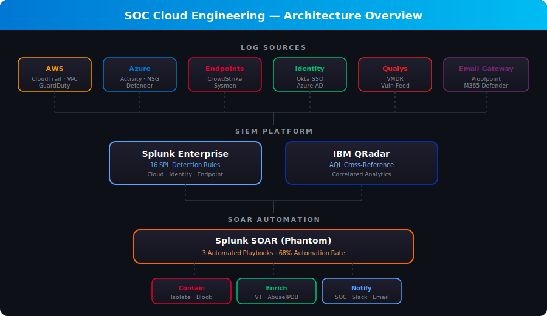
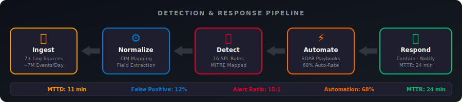
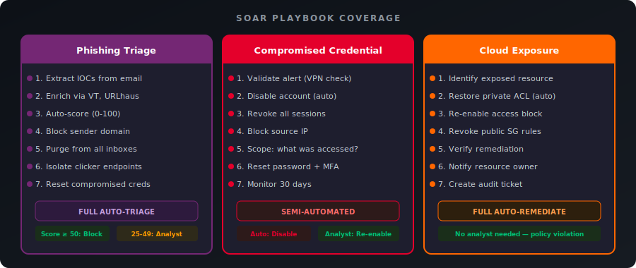

<p align="center">
  
  
  
  
  
</p>

# SOC Cloud Engineering — Detection, Automation & Response

> **Enterprise SOC engineering for cloud environments** — building detection rules in Splunk SPL, automating incident response with SOAR playbooks, integrating vulnerability feeds from Qualys, and monitoring cloud infrastructure across Azure and AWS.

## Objective

Design and implement a SOC engineering workflow for a cloud-first organization, covering the full detection-to-response pipeline: log ingestion, detection engineering with Splunk SPL and QRadar, SOAR-driven automated response, vulnerability feed integration from Qualys, and cloud-native security monitoring. This project demonstrates the technical skills required for a SOC Cloud Engineer role.

---

## Architecture

<p align="center">
  
</p>

## Detection & Response Pipeline

<p align="center">
  
</p>

---

## Log Sources & Data Pipeline

| Log Source | Platform | Ingestion Method | Events/Day |
|-----------|----------|-----------------|------------|
| AWS CloudTrail | AWS | S3 → Splunk HEC | ~500K |
| Azure Activity Logs | Azure | Event Hub → Splunk Add-on | ~200K |
| VPC Flow Logs | AWS | S3 → Splunk | ~2M |
| Azure NSG Flow Logs | Azure | Blob Storage → Splunk | ~1.5M |
| GuardDuty Findings | AWS | CloudWatch → Lambda → HEC | ~1K |
| Defender for Cloud | Azure | Event Hub → Splunk | ~5K |
| Qualys VMDR | Multi-cloud | API Poll (hourly) | ~10K |
| Okta SSO | SaaS | API → Splunk Add-on | ~50K |
| CrowdStrike EDR | Endpoints | Falcon Data Replicator → S3 | ~3M |

## Project Structure

```
soc-cloud-engineering/
├── splunk-detections/          # Splunk SPL detection rules
│   ├── cloud-detections.spl
│   ├── identity-detections.spl
│   └── endpoint-detections.spl
├── soar-playbooks/             # SOAR automation playbooks
│   ├── playbook-phishing-triage.md
│   ├── playbook-compromised-credential.md
│   └── playbook-cloud-resource-exposure.md
├── cloud-monitoring/           # Cloud security monitoring
│   └── aws-azure-monitoring.md
├── LICENSE
├── SECURITY.md
└── README.md
```

---

## Splunk SPL Detection Rules

Custom detection rules organized by attack surface. Full SPL queries are available in the [splunk-detections/](splunk-detections/) directory.

### Cloud Security Detections

| # | Detection | MITRE ATT&CK | Severity | SPL File |
|---|-----------|-------------|----------|----------|
| 1 | AWS Root Account Usage | T1078.004 | Critical | [cloud-detections.spl](splunk-detections/cloud-detections.spl) |
| 2 | S3 Bucket Made Public | T1530 | Critical | [cloud-detections.spl](splunk-detections/cloud-detections.spl) |
| 3 | Security Group Allows 0.0.0.0/0 | T1562.007 | High | [cloud-detections.spl](splunk-detections/cloud-detections.spl) |
| 4 | Azure AD Conditional Access Policy Disabled | T1556 | High | [cloud-detections.spl](splunk-detections/cloud-detections.spl) |
| 5 | CloudTrail Logging Disabled | T1562.008 | Critical | [cloud-detections.spl](splunk-detections/cloud-detections.spl) |
| 6 | Unauthorized Region Activity | T1535 | Medium | [cloud-detections.spl](splunk-detections/cloud-detections.spl) |
| 7 | IAM Policy Allows Full Admin | T1098.001 | High | [cloud-detections.spl](splunk-detections/cloud-detections.spl) |

### Identity & Access Detections

| # | Detection | MITRE ATT&CK | Severity | SPL File |
|---|-----------|-------------|----------|----------|
| 1 | Impossible Travel Login | T1078 | High | [identity-detections.spl](splunk-detections/identity-detections.spl) |
| 2 | MFA Disabled for User | T1556.006 | High | [identity-detections.spl](splunk-detections/identity-detections.spl) |
| 3 | Brute Force Against Cloud SSO | T1110.001 | High | [identity-detections.spl](splunk-detections/identity-detections.spl) |
| 4 | Service Account Anomalous Login | T1078.004 | Medium | [identity-detections.spl](splunk-detections/identity-detections.spl) |
| 5 | Privileged Role Assigned Outside PIM | T1098 | High | [identity-detections.spl](splunk-detections/identity-detections.spl) |

### Endpoint Detections

| # | Detection | MITRE ATT&CK | Severity | SPL File |
|---|-----------|-------------|----------|----------|
| 1 | Encoded PowerShell Execution | T1059.001 | High | [endpoint-detections.spl](splunk-detections/endpoint-detections.spl) |
| 2 | LSASS Memory Access | T1003.001 | Critical | [endpoint-detections.spl](splunk-detections/endpoint-detections.spl) |
| 3 | Suspicious Scheduled Task Creation | T1053.005 | Medium | [endpoint-detections.spl](splunk-detections/endpoint-detections.spl) |
| 4 | Lateral Movement via WMI | T1047 | High | [endpoint-detections.spl](splunk-detections/endpoint-detections.spl) |

---

## SOAR Playbooks

<p align="center">
  
</p>

Automated incident response playbooks designed for Splunk SOAR (Phantom). Each playbook includes trigger conditions, enrichment steps, containment actions, and notification workflows.

| Playbook | Trigger | Automation Level | File |
|----------|---------|-----------------|------|
| Phishing Email Triage | Email reported by user or gateway alert | Full auto-triage, analyst approval for containment | [playbook-phishing-triage.md](soar-playbooks/playbook-phishing-triage.md) |
| Compromised Credential Response | Impossible travel or brute force success | Semi-automated (auto-disable, analyst confirms) | [playbook-compromised-credential.md](soar-playbooks/playbook-compromised-credential.md) |
| Cloud Resource Public Exposure | S3/Blob public access or open security group | Full auto-remediate + notify | [playbook-cloud-resource-exposure.md](soar-playbooks/playbook-cloud-resource-exposure.md) |

---

## Qualys VMDR Integration

### Vulnerability Feed Pipeline

```
Qualys VMDR API → Splunk (TA-QualysCloud) → Enrichment Lookups → Correlation with Threat Intel
```

| Integration Point | Method | Purpose |
|-------------------|--------|---------|
| Asset Inventory Sync | Qualys API → CSV Lookup | Map IPs to asset owners, criticality, environment |
| Vulnerability Feed | Qualys API → Splunk Index | Correlate vulns with active threat detections |
| Patch Compliance | Qualys Policy Compliance → Dashboard | Track remediation SLA compliance |
| Zero-Day Alerting | Qualys RTI → SOAR Trigger | Auto-escalate when new zero-day matches assets |

### Qualys-Enriched Splunk Query

```spl
| Enrich detections with Qualys vulnerability data for the affected host
index=qualys_vmdr
| dedup ip
| eval severity_score=case(
    severity=="5", "Critical",
    severity=="4", "High",
    severity=="3", "Medium",
    severity=="2", "Low",
    1==1, "Info")
| join type=left ip [
    | inputlookup asset_inventory.csv
    | fields ip, asset_owner, business_unit, environment, criticality
]
| where severity_score IN ("Critical", "High")
| where criticality="production"
| stats count by ip, asset_owner, severity_score, title, cve_id, solution
| sort -count
```

---

## QRadar Cross-Reference

### SPL to AQL Translation Guide

For SOC teams operating both Splunk and QRadar, key detection translations:

| Use Case | Splunk SPL | QRadar AQL |
|----------|-----------|------------|
| Failed Logins (last 1h) | `index=auth action=failure \| stats count by src_ip \| where count>10` | `SELECT sourceip, COUNT(*) FROM events WHERE category='Authentication' AND outcome='Failure' GROUP BY sourceip HAVING COUNT(*)>10 LAST 1 HOURS` |
| CloudTrail Root Login | `index=aws_cloudtrail userIdentity.type=Root eventName=ConsoleLogin` | `SELECT * FROM events WHERE logsourceid=<ct_id> AND username='root' AND eventname='ConsoleLogin'` |
| New Admin User Created | `index=azure_ad operationName="Add member to role" targetResources{}.modifiedProperties{}.newValue="*Admin*"` | `SELECT * FROM events WHERE logsourceid=<azad_id> AND eventname='Add member to role' AND message ILIKE '%admin%'` |

---

## Cloud Monitoring Dashboard Metrics

### SOC KPIs Tracked

| Metric | Target | Current | Trend |
|--------|--------|---------|-------|
| Mean Time to Detect (MTTD) | < 15 min | 11 min | Improving |
| Mean Time to Respond (MTTR) | < 30 min | 24 min | Improving |
| Alert-to-Incident Ratio | < 20:1 | 15:1 | On Target |
| False Positive Rate | < 15% | 12% | On Target |
| SOAR Automation Rate | > 60% | 68% | Exceeding |
| Critical Vuln SLA Compliance | > 95% | 92% | Needs Work |
| Cloud Asset Coverage | 100% | 97% | On Target |

---

## Key Skills Demonstrated

- Splunk SPL query authoring for detection engineering
- SOAR playbook design and automation workflows (Splunk SOAR/Phantom)
- QRadar AQL fundamentals and cross-SIEM translation
- Qualys VMDR integration and vulnerability correlation
- Cloud log ingestion (AWS CloudTrail, Azure Activity Logs, VPC Flow Logs)
- MITRE ATT&CK mapping for cloud-specific techniques
- SOC metrics and KPI-driven operations
- Multi-cloud security monitoring (AWS + Azure)
